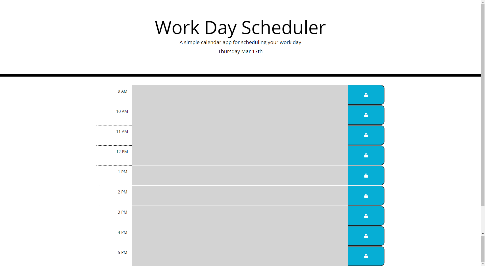

# Week 5: Challenge 5: Work Day Scheduler Starter Code

This week's challenge consists of using javacript, powered by Bootstrap and Jquery, to build a scheduler for your typical workday hours.

Live URL: https://e-lexis.github.io/Work-Day-Scheduler/

